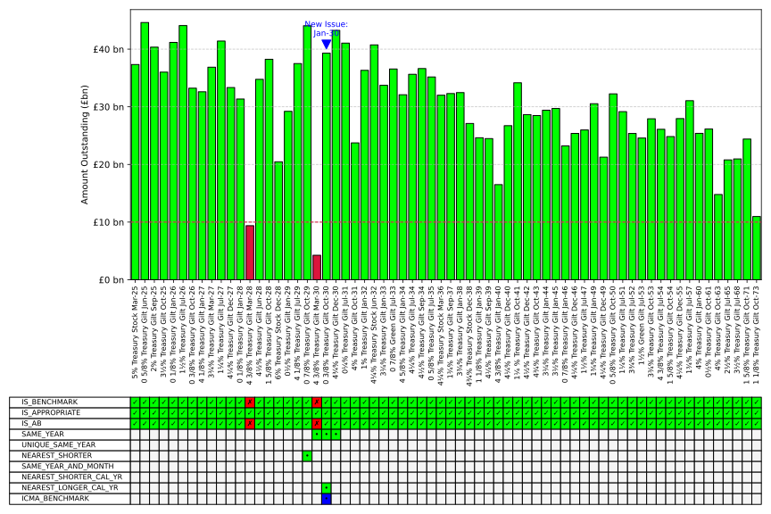

# Benchmarks

# 
Determine which Gilt would be the benchmark for a
corporate bond issuance based on ICMA guidance.

https://www.icmagroup.org/assets/Chapter-7-Jan-2022-update.pdf

**R7.3**\
All gilts with an aggregate nominal amount of £10 billion or more
should be considered as benchmarks, unless inappropriate,
including, for example due to high coupons, lack of liquidity or the
fact that there may be a more suitable alternative closer in maturity.
July 2016

**7.3A**\
R7.3 references generic reasons why a gilt might not be appropriate
as a benchmark but does not reference specific gilts for futureproofing reasons. However, primary market practitioners currently
seem generally to consider that two existing gilts are inappropriate as
credit benchmarks in the context of R7.3: 5% March 2025 and 6%.

**R7.4**\
The credit benchmark to reference in pricing a specific new Sterling
bond should be:
(a) where there is only one benchmark maturing in the same calendar
year as that bond, that benchmark;
(b) where there is no benchmark maturing in that calendar year, the
nearest shorter maturity benchmark;
(c) where there is more than one benchmark maturing in that
calendar year: (i) the benchmark maturing in the same month
as that bond, or failing which; (ii) the nearest shorter maturity
benchmark in that calendar year, or failing which; (iii) the nearest
longer maturity benchmark in that calendar year.

## Summary
Benchmark = Amt Out >= £10bn\
Appropriate = ?
 - Not Illiquid
 - Not High Coupon
 - Not a more suitable alternative?

=> Generate list of Appropriate Benchmarks

Let AB be the set of Appropriate Benchmarks
Reference = IF(Benchmark AND Appropriate):\
RULE 1) filter AB for year = n. If len(AB) = 1, use that.
if rule 1 not met move to rule 2\
RULE 2) filter AB for year = n and month = m. If len(AB) = 1, use that.\
RULE 3) filter AB for year = n, and shorter than Maturity. Take Longest.

## Visualisation
The program produces a chart and integrated table showing the breakdown
of the rules engine.\
Here is an illustrative output:\

## Benchmark Bonds
Benchmark stocks are those gilts of which a large quantity has been issued, which are actively traded, and which tend to pay interest at rates in line with the prevailing market level of yields. Benchmark stocks provide a reference for the market and are also used to price other instruments of corresponding maturity, such as corporate bonds. 
https://publications.parliament.uk/pa/cm199900/cmselect/cmtreasy/154/15407.htm